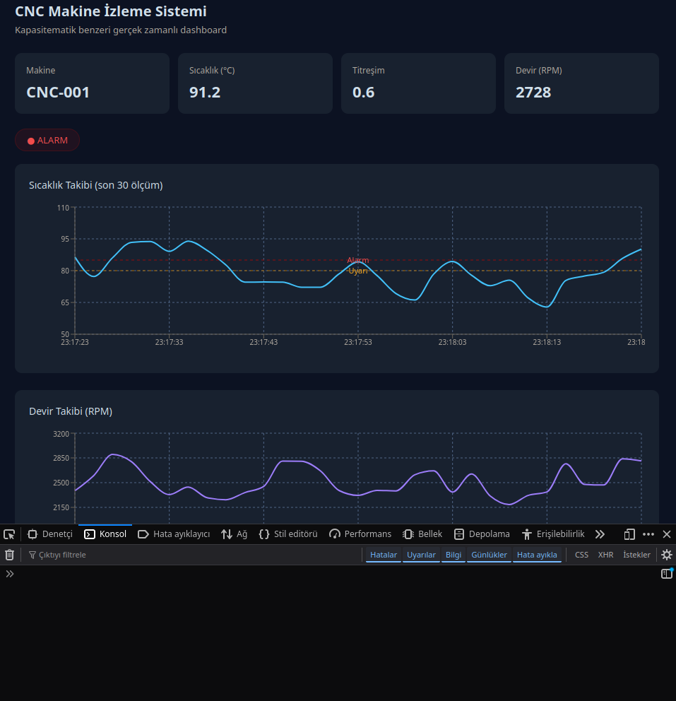

# CNC Makine İzleme Sistemi

Endüstriyel CNC tezgahlarından gerçek zamanlı veri toplayan, analiz eden ve görselleştiren full-stack IoT platformu.

Tezmaksan'ın [Kapasitematik](https://www.tezmaksan.com) ürününden ilham alınarak geliştirilmiştir.

## 🎯 Ne Yapıyor?

- CNC makinelerinden **MQTT protokolü** ile gerçek zamanlı veri toplar
- Sıcaklık, titreşim ve devir verilerini **WebSocket** ile anlık iletir
- Eşik değeri aşıldığında otomatik **alarm** üretir
- React dashboard'unda **canlı grafik** ve alarm paneli gösterir

## 📸 Ekran Görüntüsü



## 🏗️ Mimari

CNC Makinesi (simülatör)
↓
MQTT Broker (Mosquitto)
↓
NestJS Backend ──→ REST API (/cnc/veriler)
↓
WebSocket Gateway
↓
React Dashboard (Recharts)

## 🛠️ Teknolojiler

| Katman | Teknoloji |
|--------|-----------|
| Mesajlaşma | MQTT (Mosquitto 2.x) |
| Backend | NestJS, TypeScript |
| Gerçek zamanlı | Socket.io (WebSocket) |
| Frontend | React, TypeScript, Recharts |
| Deploy | Railway |

## 🚀 Kurulum

### Gereksinimler
- Node.js 18+
- Mosquitto MQTT broker

### MQTT Broker
```bash
mosquitto -c mqtt-broker/mosquitto.conf -d
```

### Backend
```bash
cd nestjs-backend
npm install
npm run start:dev
```

### Frontend
```bash
cd react-dashboard
npm install
npm start
```

Tarayıcıda `http://localhost:3001` aç.

## 📡 MQTT Topic Yapısı

| Topic | Açıklama |
|-------|----------|
| `fabrika/cnc/{id}/veri` | Anlık makine verisi |
| `fabrika/cnc/{id}/alarm` | Sıcaklık alarm bildirimi |

## 🔧 Alarm Mantığı

| Sıcaklık | Durum |
|----------|-------|
| < 80°C | Çalışıyor ✅ |
| 80–90°C | Duruş ⚠️ |
| > 90°C | Alarm 🚨 |

## 👤 Geliştirici

**Uğur Tayyip Koca** — Yazılım Teknikeri  
[github.com/ugurdev58](https://github.com/ugurdev58)

